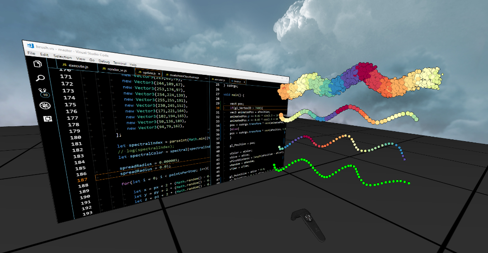

# Fenek

Fenek is a live coding JavaScript framework for OpenGL 4.5 and VR that allows users to tweak the render engine, scene, input handling and shaders at runtime and directly in VR without the need to take off the HMD. Video:

<a href="https://youtu.be/xhGNhKVAqW0" target="_blank">
	
</a>

## Getting Started

### Install

The source code should compile with no issues with Visual Studio 2017 in Windows 10, but you may have to select a different Windows SDK version. Open the project property page and select one of the available Windows SDK Versions from the dropdown.

After the project is compiled, copy following files to _./bin/Release_x64_:

* libs/openvr/openvr_api.dll
* libs/v8/run/icui18n.dll
* libs/v8/run/icuuc.dll
* libs/v8/run/natives_blob.bin
* libs/v8/run/snapshot_blob.bin
* libs/v8/run/v8.dll
* libs/v8/run/v8_libbase.dll
* libs/v8/run/v8_libplatform.dll

Then, open the workspace in [Visual Studio Code](https://code.visualstudio.com/) by right clicking an empty region inside the solution/project/workspace folder (the one that contains .vscode) and then selecting "Open with Code". Start the application from vscode by pressing __ctrl+shift+b__.

### What to do

Most JS script files are executed on save (ctrl+s). Take a look at __start.js__ (use ctrl+e to find files). This file is only executed once at startup, but all the files that are executed by watchJS() inside start.js are monitored and executed on save. 

Now take a look at __execute2.js__. This file is executed when you press ctrl+s. Uncomment the line ```vr.start();``` and save the file to start VR mode. Feel free to experiment with the other code in that file as well.

By default, the controllers are set to a brush action. If you press and hold the trigger button on the back of your controller, you'll be able to draw some stuff in VR using the brush. Now go to __update.js__ in order to change the controller action. Find the line that calls ```updateControllerBrushing();```, put it in comments, and uncomment ```updatePicking();``` instead. You'll now be in pick mode, which allows you to pick one of the objects in the scene and then drag&drop it into the desktop mirror.

You can also experiment with the ```updateControllerBrushing``` function in __update.js__ to change the brush generation code, and with __brush.vs__ to change the brush rendering code. 

The heart of the rendering engine are the update() and render() functions as defined in update.js and render.js. These two functions are called from the underlying C++ code each frame. 

The JS to C++ OpenGL bindings are defined in _V8Helper.cpp_ and _V8GLExtBindings.cpp_. The latter is mostly automatically generated by _createBindings.js_. Bindings to OpenVR are located in _V8VR.cpp_.

## Limitations

This project is an early prototype that is super unstable. It works, but you should expect crashes, bugs and frequent breaking changes as it is updated.

## Performance

With a most basic rendering loop that does nothing but call gl.clearColor and gl.clear, Fenek runs at 5000 fps on a GTX 1080. A basic scene consisting of a skybox and a ground plane, and with Eye-Dome-Lighting disabled, Fenek runs at up to 1500 fps. 

## License

This project is licensed under the 2-Clause BSD License, see LICENSE.txt.
Some parts of the engine, mainly the math classes is *src_js/math*, are heavily inspired and partially taken from [three.js](https://github.com/mrdoob/three.js/), which is available under the [MIT License](https://github.com/mrdoob/three.js/blob/dev/LICENSE).

## References

Following papers are based on this project:

* *Live Coding of a VR Render Engine in VR*, Markus Schütz, Michael Wimmer, IEEE VR 2019 (accepted, to be published)